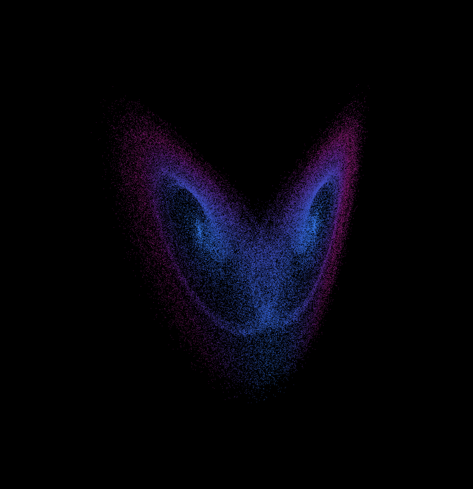
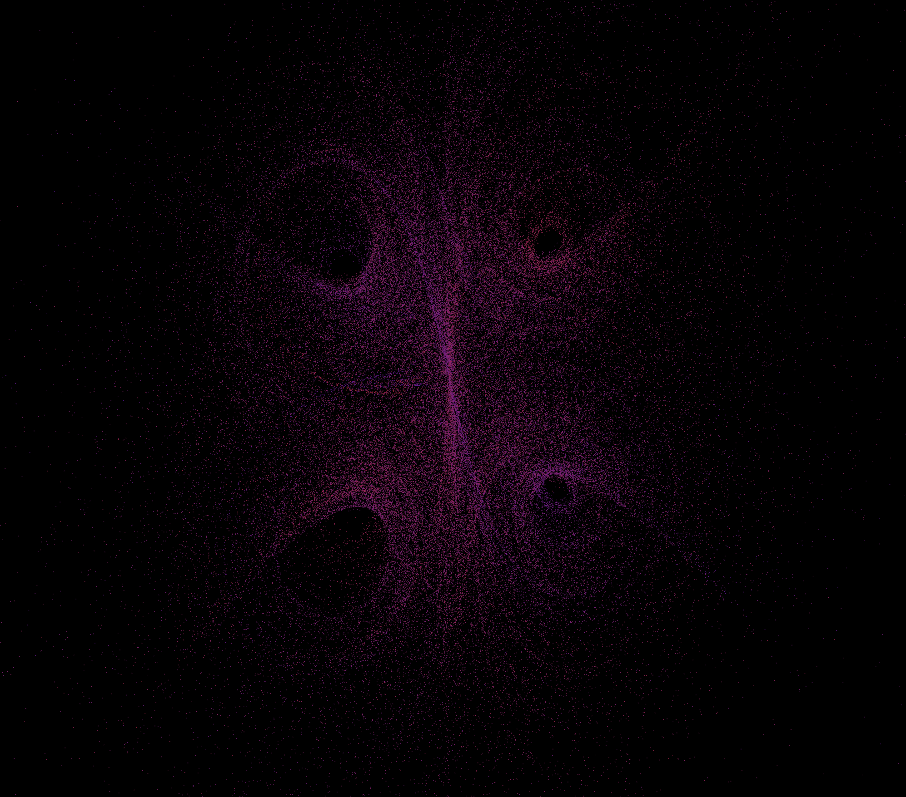
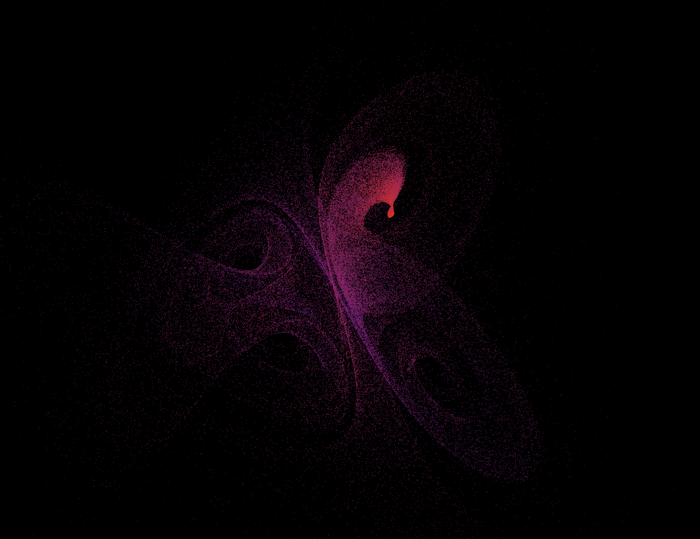

# Strange Attractors

Interactive WebGL visualizer for chaotic dynamical systems. Up to 100,000 particles are integrated live using a 4th-order Runge-Kutta solver and rendered as a cloud you can orbit and zoom into.

## Attractors

**Lorenz system**: 3D strange attractor with parameters σ = 10, ρ = 28, β = 8/3. A particle simulation with speed-based coloring and a sensitive-dependence on initial conditions plot, showing how close trajectories diverge exponentially over time, are simulated.



**4D Hyperchaotic attractor**: 4D system from Dadras, Momeni & Qi. Particles are colored based on their *w* coordinate. Pausing the simulation enables the use of a "slice" slider that filters particles to *w ± ε* values, showcasing the attractor's 4d chaotic structure.

 

## Stack

- TypeScript + Vite, rendered with WebGL
- RK4 numerical integration running on the CPU each frame
- KaTeX for equation rendering in the info panel

## Running locally

```bash
npm install
npm run dev
```
